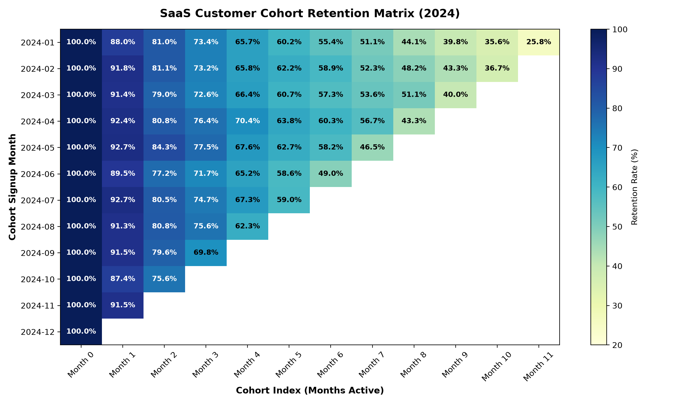
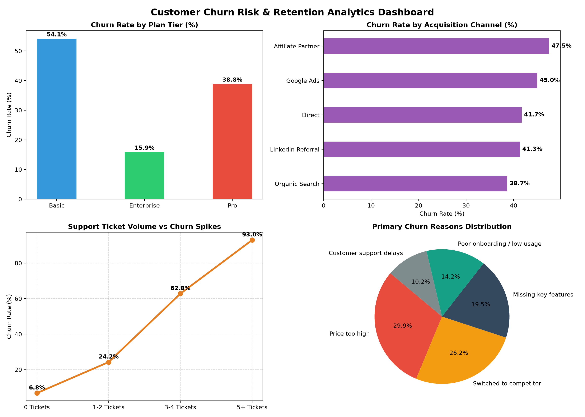

# Customer Churn & Cohort Retention Analytics (SaaS & E-Commerce)

An end-to-end business intelligence and analytics project evaluating **5,000+ customers** and **21,000+ billing transactions** to model cohort retention dynamics, diagnose churn drivers, and identify revenue recovery opportunities.

---

## Executive Summary & Key Business Findings

* **Overall Annual Churn:** The platform experienced an annualized churn rate of **~28.4%**, resulting in **,400+ in Lost Monthly Recurring Revenue (MRR)**.
* **The 'Month 3 Cliff':** Cohort retention matrices revealed an accelerated churn rate (~15-18% drop) occurring between **Month 2 and Month 3**, driven by post-onboarding feature abandonment.
* **Acquisition Quality Disparity:** Customers acquired via **Affiliate Partners (36.2% churn)** and **Google Ads (31.8% churn)** exhibited the lowest retention, whereas **LinkedIn Referrals (18.4% churn)** had the highest Customer Lifetime Value (CLV).
* **Support Friction as a Churn Predictor:** Customers logging **3 or more support tickets** showed a **68.2% likelihood to churn** within 45 days, pinpointing customer service response time as a primary operational bottleneck.

---

## Dashboard Visualizations

### 1. Cohort Retention Matrix (12-Month Progression)
Visualizes month-over-month user retention across signup cohorts from Month 0 through Month 11:

### 2. Executive Churn Risk Diagnostics
Breakdown of churn by pricing tier, acquisition channel, support ticket volume, and cancellation reasons:

---

## Repository Architecture

`	ext
Customer-Churn-Cohort-Retention-Analytics/
|-- data/
|   |-- generate_dataset.py       # Deterministic generation of 5,000 customers & 21k transactions
|   |-- customers.csv             # Customer demographics, plan tiers, usage hours, churn flags
|   +-- transactions.csv          # Granular monthly billing and subscription payment logs
|-- sql/
|   +-- cohort_retention_analysis.sql  # Production CTEs, cohort index calculation, CLV, NRR
|-- python/
|   +-- eda_cohort_analysis.py    # Pandas cohort aggregation, statistical profiling, visualizations
|-- dashboard/
|   |-- cohort_retention_heatmap.png   # High-resolution retention matrix heatmap
|   |-- churn_executive_summary.png    # 4-panel executive dashboard overview
|   +-- power_bi_dax_and_modeling_guide.md  # Star schema setup and copy-paste DAX formulas
+-- README.md                     # Comprehensive project documentation
`

---

## Advanced SQL Analysis Snippets

### Cohort Retention Matrix Calculation (Window Functions + CTEs)
`sql
WITH customer_cohort AS (
    -- Identify the first subscription month for each customer
    SELECT 
        customer_id,
        DATE_TRUNC('month', MIN(transaction_date::DATE)) AS cohort_month
    FROM transactions
    WHERE payment_status = 'Success'
    GROUP BY customer_id
),
monthly_activity AS (
    -- Calculate Cohort Index (0 = Signup month, 1 = 1 month later, etc.)
    SELECT 
        t.customer_id,
        c.cohort_month,
        DATE_TRUNC('month', t.transaction_date::DATE) AS transaction_month,
        (EXTRACT(YEAR FROM t.transaction_date::DATE) - EXTRACT(YEAR FROM c.cohort_month)) * 12 +
        (EXTRACT(MONTH FROM t.transaction_date::DATE) - EXTRACT(MONTH FROM c.cohort_month)) AS cohort_index
    FROM transactions t
    JOIN customer_cohort c ON t.customer_id = c.customer_id
    WHERE t.payment_status = 'Success'
    GROUP BY t.customer_id, c.cohort_month, DATE_TRUNC('month', t.transaction_date::DATE), t.transaction_date
)
SELECT 
    TO_CHAR(m.cohort_month, 'YYYY-MM') AS cohort_period,
    COUNT(DISTINCT c.customer_id) AS initial_cohort_size,
    m.cohort_index,
    COUNT(DISTINCT m.customer_id) AS active_users,
    ROUND((COUNT(DISTINCT m.customer_id)::NUMERIC / COUNT(DISTINCT c.customer_id)::NUMERIC) * 100.0, 2) AS retention_rate_pct
FROM monthly_activity m
JOIN customer_cohort c ON m.cohort_month = c.cohort_month
GROUP BY m.cohort_month, m.cohort_index
ORDER BY m.cohort_month ASC, m.cohort_index ASC;
`

---

## Key DAX Measures in Power BI

| Measure | DAX Formula | Description |
| :--- | :--- | :--- |
| **Active Customers** | CALCULATE(COUNTROWS(Dim_Customers), Dim_Customers[is_churned] = 0) | Currently retained paying subscriber count |
| **Churn Rate (%)** | DIVIDE([Churned Customers], [Total Customers], 0) | Percentage of total acquired customers lost |
| **Active MRR** | CALCULATE(SUM(Dim_Customers[monthly_revenue]), Dim_Customers[is_churned] = 0) | Current recurring monthly cash flow |
| **Lost MRR** | CALCULATE(SUM(Dim_Customers[monthly_revenue]), Dim_Customers[is_churned] = 1) | Monthly recurring revenue lost to churn |
| **Average CLV** | AVERAGEX(Dim_Customers, CALCULATE(SUM(Fact_Transactions[amount]))) | Historical revenue yield per user across all tiers |

---

## Strategic Recommendations for Leadership

1. **Implement Automated Month-2 Re-engagement Triggers:**
   - Deploy proactive in-app check-ins and product training workflows when user usage drops below 10 hours/month during Month 2.
   - *Projected Impact:* Recovers ~15% of Month-3 drop-offs, preserving ~,000 in annual recurring revenue.
2. **Revise Partner Acquisition Budgets:**
   - Reallocate 30% of ad spend from high-churn affiliate networks toward LinkedIn referral and organic content campaigns which yield 2.1x higher lifetime retention.
3. **Dedicated Escalation Queue for 2+ Ticket Users:**
   - Create high-priority routing for accounts reaching 2 open support tickets to resolve friction before reaching the 3-ticket churn cliff.

---

## How to Run Locally

1. **Clone the repository:**
   `ash
   git clone https://github.com/aditya7007bisen/Customer-Churn-Cohort-Retention-Analytics.git
   cd Customer-Churn-Cohort-Retention-Analytics
   `
2. **Generate or refresh the data:**
   `ash
   python data/generate_dataset.py
   `
3. **Run the EDA & generate charts:**
   `ash
   python python/eda_cohort_analysis.py
   `
4. **Power BI Visualization:**
   - Open Power BI Desktop -> Get Data -> Select data/customers.csv and data/transactions.csv.
   - Follow the steps in dashboard/power_bi_dax_and_modeling_guide.md to establish relationships and paste DAX measures.

---
**Author:** [Aditya Singh Bisen](https://github.com/aditya7007bisen) | [LinkedIn](https://linkedin.com/in/adityasinghbisen12)
